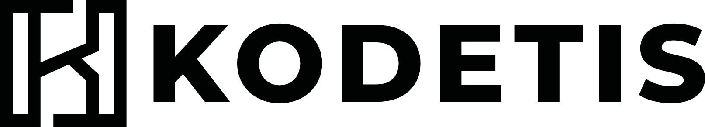

# Kodetis

This is the open-source home of **Kodetis**, a cybersecurity and data/AI company based in La Reunion, France.

We publish here the tools, libraries, and projects we build and maintain — open to inspect, extend, and self-host.

## Get started

- Website: [kodetis.com](https://kodetis.com)
- Issues & discussions: on each repository

## Contributing

Contributions welcome. Open an issue first for anything non-trivial. See each repo's CONTRIBUTING.md for details.

